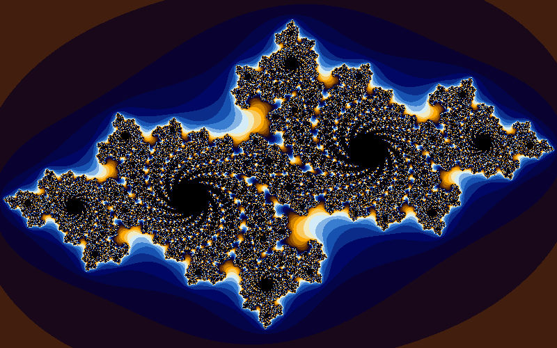
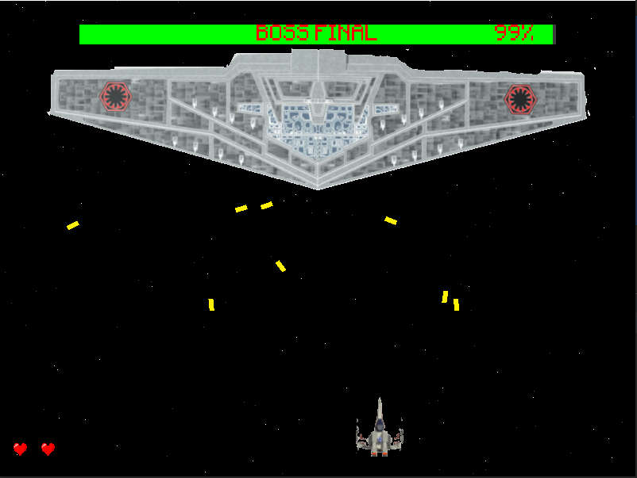
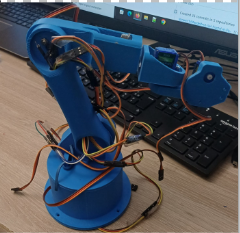

# 🚀 My Projects

### Portfolio
[GitHub](https://github.com/Imrann19/Imrann19.github.io)

### Rust: Game Higher or Lower  
[GitHub](https://github.com/Imrann19/Rust-Game-Higher-or-Lower)  

### Python: Game Higher or Lower  
[GitHub](https://github.com/Imrann19/Python-Game-Higher-or-Lower)  

### Mandelbrot Set Fractal in Python
  
[GitHub](https://github.com/Imrann19/Mandelbrot-Set-Fractal-in-Python)
[YouTube Video](https://www.youtube.com/watch?v=eYUTN04xZbY)

### Julia Set Fractal in Python
  
[GitHub](https://github.com/Imrann19/Julia-Set-Fractal-in-Python)
[YouTube Video](https://www.youtube.com/watch?v=eYUTN04xZbY)

### Star Battle
  
[GitHub](https://github.com/Imrann19/star_battle)  
[YouTube Video](https://www.youtube.com/watch?v=W2XfgvUIgww)

### Flappy Bird (Python)
  
[GitHub](https://github.com/Imrann19/Flappy-Bird_Python)  
[YouTube Video](https://www.youtube.com/watch?v=WikE-csSIPU)

### MNIST Number Classification with TensorFlow  
[GitHub](https://github.com/Imrann19/MNIST-Number-classification-with-TensorFlow)

### French Middle School Oral Exam AI
  
[GitHub](https://github.com/Imrann19/French-Middle-School-Oral-Exam-AI)

### Predicting the Sum of Two Numbers with TensorFlow  
[GitHub](https://github.com/Imrann19/Predicting-the-sum-of-Two-Numbers-with-Tensorflow)

### Reinforcement Learning in Gridworld with Q-learning
[GitHub](https://github.com/Imrann19/Reinforcement-Learning-in-Gridworld-with-Q-learning)

### Linear Prediction with TensorFlow  
[GitHub](https://github.com/Imrann19/Linear-Prediction-with-TensorFlow)

### My First Robotic Arm
  
[GitHub](https://github.com/Imrann19/My-First-Robotic-Arm)
